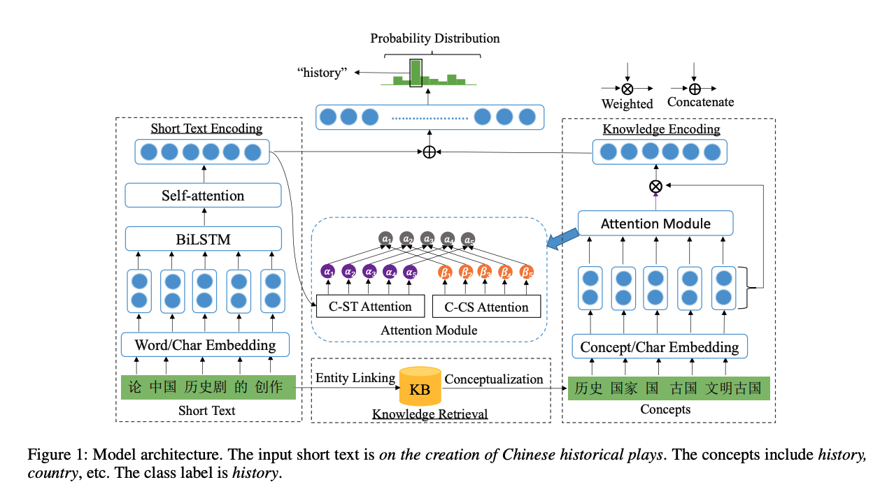

# Attention

1. STCKA

    Year: 2019

    Paper name: Deep Short Text Classification with Knowledge Powered Attention

    Paper link: https://arxiv.org/pdf/1902.08050

    Motivation: Short text classification is one of important tasks in Natural Language Processing (NLP). Unlike paragraphs or documents, short texts are more ambiguous since they have not enough contextual information, which poses a great challenge for classification

    Innovation(contribution):

    proposed deep Short Text Classification with Knowledge Powered Attention. first attention model which combines prior knowledge in knowledge bases to enrich the semantic information of the short text.
    
    introduce two attention mechanisms (i.e., C-ST and C-CS attention) to measure the importance of each concept from two aspects and combine them by a soft switch to acquire the weight of concept adaptively.
    
    conduct extensive experiments on four datasets for different tasks. The results show that the model outperforms the state-of-the-art methods.

    Brief structure:

    

    Concept towards Short Text (C-ST) Attention and Concept towards Concept Set (C-CS) Attention. C-ST Attention measures the semantic similarity between the short text and its associated concepts, while C-CS Attention evaluates the importance of each concept relative to the entire concept set. This knowledge integration helps the model better understand the semantics of short texts, improving classification accuracy.

    Effectiveness:

    Others:
