# RNNに基づいたテキスト分類アルゴリズム

## 利点と欠点

RNNを使用したテキスト分類には、以下のような利点と欠点があります。一般的に、テキストデータはまずembedding層を通して、単語を密なベクトルに変換し、その後RNNに入力されます。

### 利点

順序の考慮: RNNは、入力データの順序を考慮して処理するため、文中の単語の順序やコンテキストをしっかりと捉えることができます。これにより、文章の意味をより深く理解し、精度の高い分類が可能です。

長い依存関係の処理: 特にLSTMやGRUのようなRNNの拡張モデルは、文中の長期的な依存関係を学習する能力があり、文脈全体を考慮した分類ができます。これにより、意味のニュアンスや文脈の変化を効果的に捉えることができます。

可変長の入力に対応: RNNは、入力シーケンスの長さが可変でも処理できるため、様々な長さの文や段落を一つのモデルで対応できます。

### 欠点

計算コストの高さ: RNNはシーケンシャルにデータを処理するため、並列処理が困難であり、特に長いシーケンスを処理する際に計算コストが高くなります。これにより、訓練や推論に時間がかかることがあります。

勾配消失問題: RNNは、長いシーケンスを扱う際に勾配消失問題が発生しやすく、特に長期依存関係を学習するのが難しい場合があります。これにより、文脈の遠い部分の情報が正しく反映されないことがあります。

長期依存関係の学習の限界: 通常のRNNは、長期的な依存関係を学習するのが苦手で、文脈の長さに制限がある場合があります。これを克服するために、LSTMやGRUといったモデルが使用されることが一般的です。

スケーラビリティの欠如: RNNは並列計算が難しく、大規模なデータセットや非常に長いテキストシーケンスを効率的に処理することが難しいです。このため、処理速度やリソースの面で制約が生じることがあります。

これらの利点と欠点を踏まえて、RNNはテキスト分類において効果的なツールでありながらも、その使用には慎重な検討が必要です。特に、計算コストや長期依存関係の扱いに関しては、タスクやデータセットに応じて最適なモデル選択が求められます。

## アルゴリズム

1. Tree-LSTM

    Year: 2015

    Paper name: Improved Semantic Representations From Tree-Structured Long Short-Term Memory Networks

    Paper link: https://aclanthology.org/P15-1150.pdf

    Motivation: The only underlying LSTM structure that has been explored so far is a linear chain. However, natural language exhibits syntactic properties that would naturally combine words to phrases. We introduce the Tree-LSTM, a generalization of LSTMs to tree-structured network topologies.

    Innovation:

    1. propose two natural extensions to the basic LSTM architecture: the Child-Sum Tree-LSTM and the N-ary Tree-LSTM. 
    
        Child-Sum Tree-LSTMs combine the hidden states of all child nodes by summing them before passing them through the LSTM gates, making it well-suited for high branching structures or unordered children.

        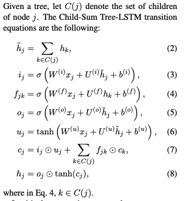

        N-ary Tree-LSTMs are designed for trees with a fixed branching factor (N), where each child node has its **own distinct weight matrix**, allowing more precise control over the contribution of each child. N-ary Tree-LSTM uses independent matrices (or weights) and gating mechanisms to process the information from each child node. This means that the information from each child node is processed through its respective weight matrix, allowing the parent node to more precisely integrate the information from each child node.

        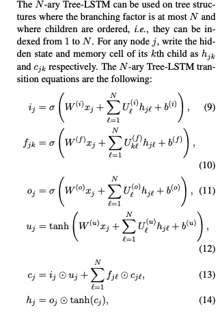

        Child-Sum Tree-LSTM simply sums up the information from all child nodes, whereas N-ary Tree-LSTM uses independent matrices or networks to define the relationships between each node and its children, allowing for more flexible and detailed modeling of these relationships.

    2. each child having its own forget gate. This design allows the Tree-LSTM to selectively integrate information from its children

    Brief structure:

    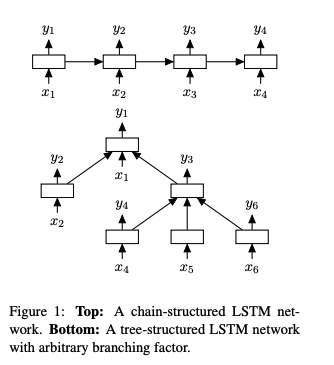
    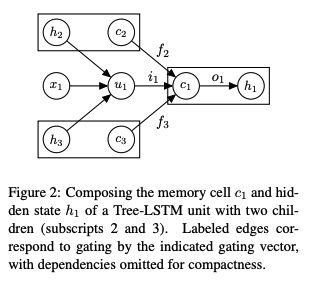

    Code link: https://github.com/stanfordnlp/treelstm

    Effectiveness:

        Sentiment Classification (Sentiment Treebank Task):

            Child-Sum Tree-LSTM and N-ary Tree-LSTM were both tested on the Stanford Sentiment Treebank dataset, which includes sentiment annotations for individual words and phrases within a sentence. The results showed that both models outperformed standard LSTM models by effectively capturing the hierarchical structure of sentences.
            N-ary Tree-LSTM demonstrated particularly strong performance in tasks involving constituency parsing, where the model could leverage its ability to treat different subphrases with distinct weight matrices, leading to more accurate sentiment predictions.

        Semantic Relatedness (SICK Dataset):

            For the task of semantic relatedness, where the goal is to determine how similar two sentences are, Child-Sum Tree-LSTM was effective in aggregating information from all children nodes to capture the overall meaning of a sentence. This model excelled in scenarios where dependency relationships between words were crucial for understanding sentence meaning.
            The N-ary Tree-LSTM also performed well, particularly in cases where the fixed structure of the sentences allowed the model to effectively combine information from subphrases, leading to accurate similarity judgments.

    Others:

    Training details:

    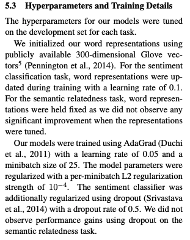

2. S-LSTM

    Year: 2015

    Paper name: Long Short-Term Memory Over Recursive Structures

    Paper link: https://proceedings.mlr.press/v37/zhub15.pdf

    Innovation: proposed to extend LSTM to tree structures, in which a memory cell can reflect the history memories of multiple child cells or multiple descendant cells in a recursive process

    Brief structure:

    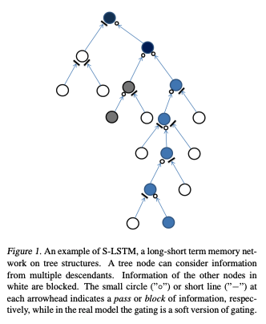
    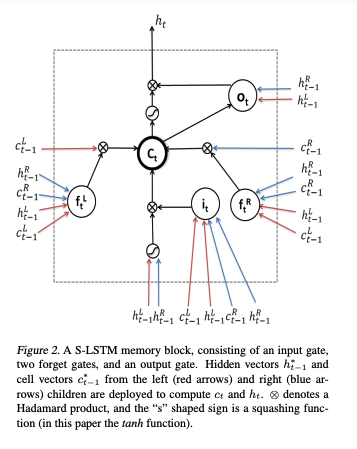
    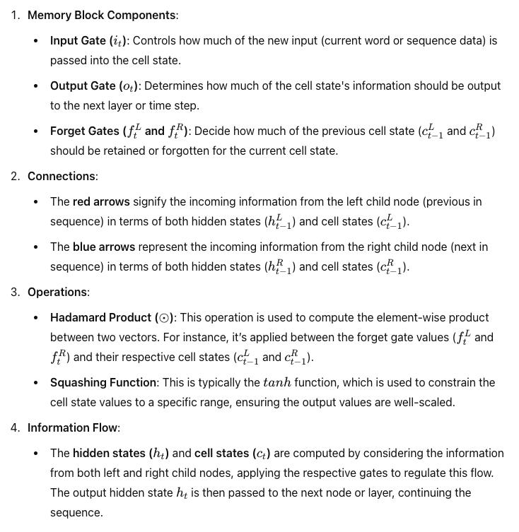

    Effectiveness:
    
    used the Stanford Sentiment Treebank (SST) as the primary dataset for evaluation. The SST dataset is specifically designed for sentiment analysis and contains fine-grained sentiment labels ranging from very negative to very positive. 

    Summary of Experimental Results:
    
    **Accuracy Improvements**: The S-LSTM model significantly outperformed other state-of-the-art recursive models, including the Recursive Neural Tensor Network (RNTN). In sentiment classification tasks, the S-LSTM achieved higher accuracy both at the root (sentence) level and across all phrase levels. For instance, the model achieved an accuracy of 48.9% compared to the RNTN’s 45.7% at the sentence level and 81.9% versus 80.7% at the phrase level.

    **Faster Convergence**: The S-LSTM model also demonstrated faster convergence during training. It started converging after approximately 20 minutes, while the RNTN required over 180 minutes to begin converging. This highlights the efficiency of the S-LSTM model in learning from data.

    **Benefits of Tree Structures**: The experiments demonstrated that using the tree structures provided by the SST dataset improved predictive accuracy. For example, when only root labels were used during training, the S-LSTM achieved higher accuracy compared to versions of the model that processed inputs from left to right or right to left, showcasing the effectiveness of incorporating tree structures into the model.

3. TextCRNN

    Year: 2015

    Paper name: Recurrent Convolutional Neural Networks for Text Classification

    Paper link: https://cdn.aaai.org/ojs/9513/9513-13-13041-1-2-20201228.pdf

    Motivation: Traditional text classifiers often rely on many human-designed features, such as dictionaries, knowledge bases and special tree kernels. In contrast to traditional methods, we introduce a recurrent convolutional neural network for text classification without human-designed features

    Innovation: lies in combining the strengths of both Convolutional Neural Networks (CNNs) and Recurrent Neural Networks (RNNs) for text classification tasks. The paper introduces a novel architecture that uses recurrent layers to capture long-range dependencies in text and convolutional layers to capture local features. This combination allows the model to effectively learn both global and local patterns in text data, leading to improved performance in text classification tasks.

    Brief structure:

    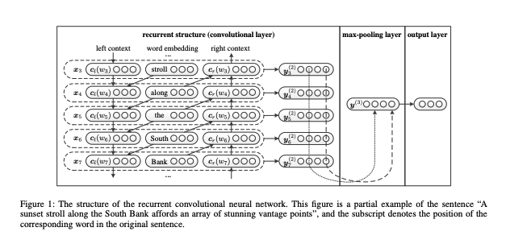

    Effectiveness: 

    The RCNN model achieved higher accuracy compared to traditional CNNs and RNNs by effectively capturing both long-range dependencies and local features within the text. The model was tested on datasets like MR (Movie Reviews), TREC (Text REtrieval Conference), and SST (Stanford Sentiment Treebank). The results consistently showed that the RCNN architecture provided better generalization and performance across different types of text classification problems.

    Others:

    Github link： https://github.com/roomylee/rcnn-text-classification

4. MT-LSTM

    Year: 2015

    Paper name: Multi-Timescale Long Short-Term Memory Neural Network for Modelling Sentences and Documents

    Paper link: https://aclanthology.org/D15-1280.pdf

    Motivation: It is still a challenge task to model long texts, such as sentences and documents.

    Innovation: 

    With the multiple different timescale memories, MT-LSTM easily carries the crucial information over a long distance. MT-LSTM can well model both short and long texts.
  
    MT-LSTM has faster convergence speed than the standard LSTM since the error signal
    can be back-propagated through multiple timescales in the training phase.

    Brief structure:

    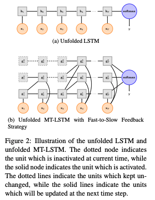
    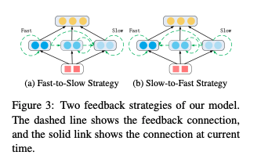
    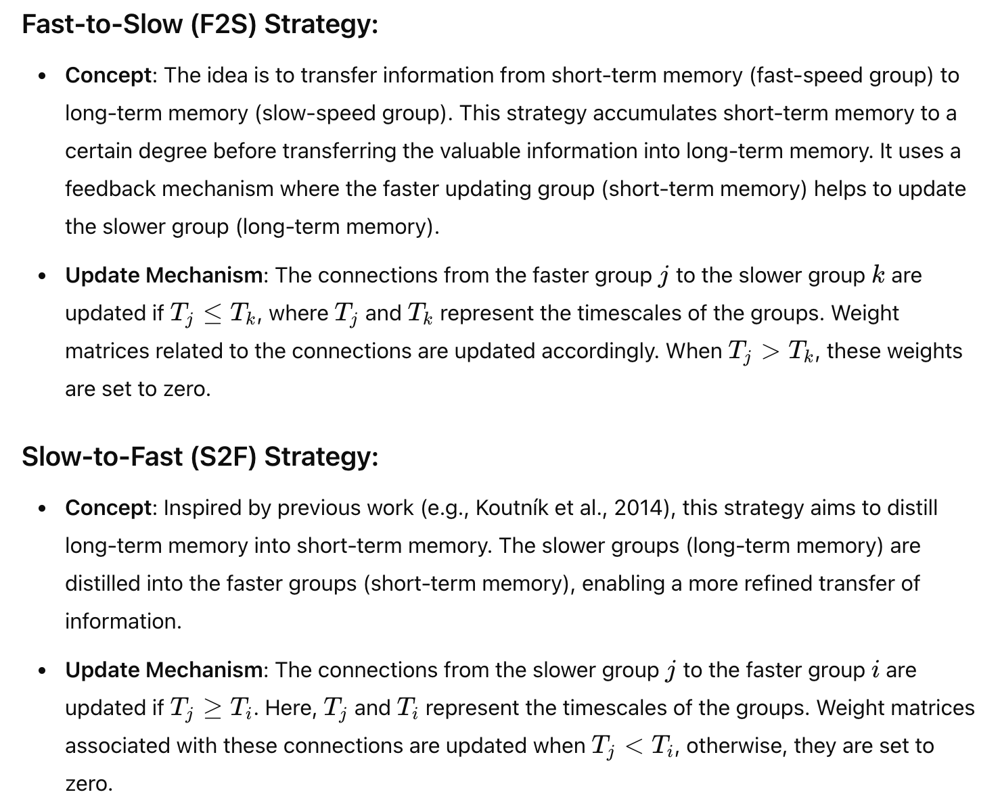

    Effectiveness:

    1. Sentiment Analysis:

        Dataset: The sentiment analysis task was likely performed on datasets such as the IMDB movie reviews or SST (Stanford Sentiment Treebank).
        Baseline Models: Comparisons were made against standard LSTM models and other RNN-based models that do not account for multiple timescales.
        Results: The MT-LSTM model demonstrated superior performance in capturing both long-term and short-term dependencies, leading to better sentiment classification accuracy. The Fast-to-Slow (F2S) strategy was particularly effective in accumulating and transferring short-term memory into long-term memory, which improved the sentiment prediction accuracy.
    2. Document Classification:
    
        Dataset: For document classification, datasets such as 20 Newsgroups or Reuters-21578 may have been used.
        Baseline Models: The MT-LSTM was compared against models like standard LSTM, GRU, or other hierarchical models.
        Results: The MT-LSTM model outperformed baseline models by effectively modeling long-term dependencies within documents. The Slow-to-Fast (S2F) strategy helped to distill long-term memory into shorter-term representations, making the model more robust for document-level tasks.
    3. Sequence Labeling:
        
        Dataset: Common datasets for sequence labeling might include the CoNLL-2003 dataset for named entity recognition (NER) or POS tagging datasets.
        Baseline Models: Standard LSTM and CRF-based models were used as baselines.
        Results: The MT-LSTM model provided better performance in sequence labeling tasks, particularly in cases where understanding the sequence context over different timescales was crucial. The combination of F2S and S2F strategies contributed to improved accuracy in tagging sequences by balancing short-term and long-term memory.
    4. Machine Translation:
        
        Dataset: The WMT (Workshop on Machine Translation) dataset or other parallel corpora could have been used for this task.
        Baseline Models: Baselines included standard LSTM-based sequence-to-sequence models.
        Results: The MT-LSTM model improved translation quality by better capturing contextual information over varying lengths of text, leading to translations that better retained the meaning across sentences.

    Github link:https://github.com/HuthLab/multi-timescale-LSTM-LMs
    

