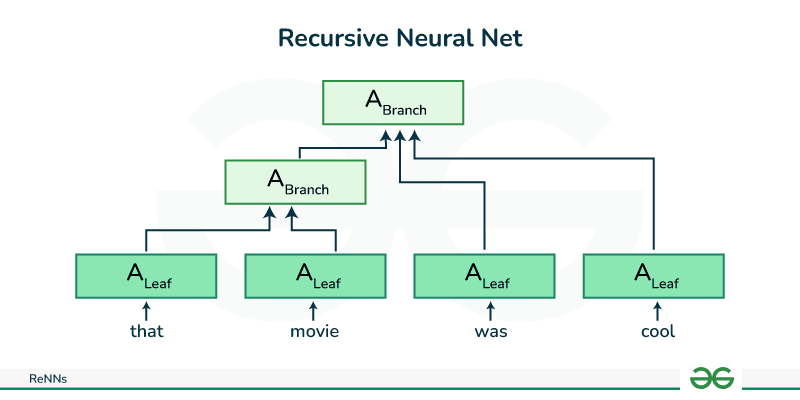

ReNN: 

A recursive neural network is a kind of deep neural network created by applying the same set of weights recursively over a structured input, to produce a structured prediction over variable-size input structures, or a scalar prediction on it, by traversing a given structure in topological order.

**RAE＿2011**

  Paper name 
  
  Semi-Supervised Recursive Autoencoders for Predicting Sentiment Distributions

  Paper link: 
  
  https://ai.stanford.edu/~ang/papers/emnlp11-RecursiveAutoencodersSentimentDistributions.pdf

  Proposed Algorithm:

  Introduced a Semi-Supervised Recursive Autoencoder (RAE) algorithm. This algorithm is designed to represent the hierarchical structure of sentences or phrases using a recursive structure.

  Applications: 
  
  The algorithm is primarily applied to sentiment analysis tasks, particularly in text classification. It can handle sentiment analysis at different levels of granularity, such as words, phrases, and sentences, and can generate sentiment distribution predictions.
  
  **MV-RNN_2012**

  Paper name: 
  
  Semantic Compositionality through Recursive Matrix-Vector Spaces

  Paper link:
  
  https://aclanthology.org/D12-1110.pdf
  
  Main annovation: The main novelty of our model is the combination of matrix-vector representations with a recursive neural network. It can learn both the meaning vectors of a word and how that word modifies its neighbors, via its matrix

**RNTN_2013**

Paper name: 

Recursive Deep Models for Semantic Compositionality Over a Sentiment Treebank

Paper link: 

https://nlp.stanford.edu/~socherr/EMNLP2013_RNTN.pdf
    
    
Main annovation: 

This model is designed to capture the compositional structure of sentences, particularly for sentiment analysis tasks. The RNTN extends traditional Recursive Neural Networks (RNNs) by introducing a tensor-based composition function that can better capture the interactions between words in a phrase.

GB-RNNs_2014

Paper name: 

Global Belief Recursive Neural Networks
    
Paper link: 

https://proceedings.neurips.cc/paper_files/paper/2014/file/1415db70fe9ddb119e23e9b2808cde38-Paper.pdf

Main annovation: 

introduces a novel architecture that combines the principles of recursive neural networks with a global belief mechanism. The model is designed to improve the ability of recursive neural networks to capture long-range dependencies and semantic information in structured data, such as parse trees.
       

        

